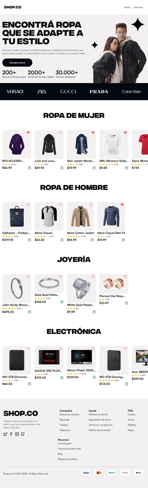

# 🛍️ Trabajo Práctico Integrador - Shop.co

> **Universidad Nacional de Jujuy - Facultad de Ingeniería**
>
> **Programación Visual** - Segundo Año 2025
>
> **Grupo 13** - Trabajo Práctico Integrador

Una plataforma de e-commerce moderna construida con **React**, **Redux Toolkit**
y **Tailwind CSS**, implementando arquitectura hexagonal y patrones de diseño.

## 📖 Resumen Ejecutivo

**Shop.co** es una aplicación web de comercio electrónico que permite a los
usuarios navegar, buscar y gestionar productos de diferentes categorías (ropa,
electrónicos, joyería). La aplicación está diseñada con principios de
**arquitectura hexagonal**, **screaming architecture** y **vertical slicing**
para garantizar escalabilidad, mantenibilidad y separación de responsabilidades.

## 📷 Screenshots

### 💻 Desktop

<!-- markdownlint-disable MD013 -->

[](./public/README/desktop.webp "Screenshot deskotp")

<!-- markdownlint-enable MD013 -->

### 📱 Mobile

<!-- markdownlint-disable MD013 -->

[](./public/README/mobile.webp "Screenshot deskotp")

<!-- markdownlint-enable MD013 -->

### 🔭 Objetivos del Proyecto

- **Académico**: Demostrar dominio de React y Redux
- **Técnico**: Implementar un sistema robusto con tipado JSDoc, validaciones y
  gestión de estado.
- **Práctico**: Crear una experiencia de usuario intuitiva y responsive.

### 👥 Equipo de Desarrollo

| Desarrollador        | GitHub                       | Responsabilidades   |
| -------------------- | ---------------------------- | ------------------- |
| **Galeed Gutiérrez** | [@GaleedGutierrez][galeed]   | Arquitectura, Redux |
| **Alfredo González** | [@Ezequiel12354s][alfredo]   | UI, Styling         |
| **Enzo Condori**     | [@IsaiasCondori][enzo]       | Vistas, Navegación  |
| **Franklin Vázquez** | [@VasquezFranklin][franklin] | Hooks, Utilidades   |

[galeed]: https://github.com/GaleedGutierrez
[alfredo]: https://github.com/Ezequiel12354s
[enzo]: https://github.com/IsaiasCondori
[franklin]: https://github.com/VasquezFranklin

## 🏗️ Arquitectura y Patrones de Diseño

### Arquitectura Hexagonal (Ports & Adapters)

La aplicación implementa **arquitectura hexagonal** para garantizar la
separación entre la lógica de negocio y los detalles de implementación:

```text
Domain Layer (Centro)
├── Product.js                 # Entidades de dominio
├── ProductCategory.js         # Enums y constantes
└── ProductRepository.js       # Contratos/Interfaces

Application Layer (Casos de Uso)
├── AllProductsGetter.js       # Obtener todos los productos
├── ProductGetter.js           # Obtener producto por ID
├── ProductsByCategoryGetter.js # Obtener por categoría
├── ProductCreator.js          # Crear producto
├── ProductUpdater.js          # Actualizar producto
└── ProductRemover.js          # Eliminar producto

Infrastructure Layer (Adaptadores)
├── ApiProductsRepository.js   # Implementación con API externa
├── FakeStoreApiRepository.js  # Adaptador para FakeStore API
└── ProductRoutes.js           # Definición de rutas
```

### Screaming Architecture

La estructura del proyecto **"grita"** su propósito comercial:

```bash
src/
├── modules/                  # Módulos de negocio
│   ├── products/             # Módulo de productos (core business)
│   ├── favorites/            # Módulo de favoritos
│   └── home/                 # Módulo de inicio
├── sections/                 # Secciones de la UI organizadas por dominio
│   ├── products/             # Componentes específicos de productos
│   └── favorites/            # Componentes específicos de favoritos
└── views/                    # Páginas principales de la aplicación
    ├── Home/                 # Vista principal del e-commerce
    ├── ProductsDetails.jsx   # Detalles del producto
    └── Favorites.jsx         # Gestión de favoritos
```

### Vertical Slicing

Cada feature está organizada verticalmente, conteniendo todos los elementos
necesarios:

```bash
modules/products/
├── domain/                  # Modelos y reglas de negocio
├── application/             # Casos de uso y lógica de aplicación
└── infrastructure/          # Implementaciones técnicas

sections/products/
├── components/               # Componentes UI específicos
├── hooks/                    # Hooks especializados
├── slice/                    # Redux slice
└── thunks/                   # Async thunks
```

## 🛠️ Stack Tecnológico

### Core Framework

- **React 19.1.0** - Biblioteca principal con las últimas características
- **React Router 7.6.2** - Enrutamiento SPA moderno
- **Vite 6.3.5** - Build tool y dev server ultrarrápido

### Gestión de Estado

- **Redux Toolkit 2.8.2** - Gestión de estado predictiva y eficiente
- **React Redux 9.2.0** - Integración React-Redux optimizada

### Diseño y Estilos

- **Tailwind CSS 4.1.8** - Framework CSS utility-first
- **Motion 12.18.1** - Animaciones fluidas y profesionales
- **Lucide React 0.513.0** - Iconografía moderna y consistente

<!-- ### Validaciones y Formularios

- **React Hook Form 7.58.0** - Gestión de formularios performante
- **Zod 3.25.67** - Validación de esquemas TypeScript-first
- **@hookform/resolvers 5.1.1** - Integración Zod + Hook Form -->

### Desarrollo y Calidad

- **ESLint 9.28.0** con plugins especializados - Linting avanzado
- **Prettier 3.5.3** - Formateo de código consistente
- **Stylelint 16.20.0** - Linting para CSS/SCSS
- **Husky 9.1.7** - Git hooks para calidad de código
- **Commitlint** - Convenciones de commits

## 🪜 Estructura del Proyecto

### Organización por Módulos de Dominio

```bash
pv_tp_integrador_grupo13/
├── public/                           # Recursos estáticos
│   ├── fonts/                        # Tipografías (Satoshi, IntegralCF)
│   └── images/                       # Imágenes de la aplicación
├── src/
│   ├── main.jsx                      # Punto de entrada
│   ├── AppRouter.jsx                 # Configuración de rutas
│   │
│   ├── modules/                      # 🏗️ Módulos de dominio
│   │   ├── products/                 # Gestión de productos
│   │   │   ├── domain/              # Entidades y reglas de negocio
│   │   │   │   ├── Product.js       # Modelo Product con JSDoc
│   │   │   │   ├── ProductCategory.js # Enum de categorías
│   │   │   │   └── ProductRepository.js # Interface repository
│   │   │   ├── application/         # Casos de uso
│   │   │   │   ├── AllProductsGetter.js
│   │   │   │   ├── ProductGetter.js
│   │   │   │   ├── ProductsByCategoryGetter.js
│   │   │   │   ├── ProductCreator.js
│   │   │   │   ├── ProductUpdater.js
│   │   │   │   └── ProductRemover.js
│   │   │   └── infrastructure/      # Implementaciones técnicas
│   │   │       ├── ApiProductsRepository.js
│   │   │       └── ProductRoutes.js
│   │   │
│   │   ├── favorites/               # Gestión de favoritos
│   │   └── home/                    # Página principal
│   │
│   ├── sections/                    # 🎨 Componentes por sección
│   │   ├── products/
│   │   │   ├── components/         # Componentes UI específicos
│   │   │   ├── hooks/              # Hooks especializados
│   │   │   ├── slice/              # Redux slice
│   │   │   └── thunks/             # Async thunks
│   │   └── favorites/
│   │
│   ├── views/                       # 📄 Páginas principales
│   │   ├── Home/
│   │   ├── ProductsDetails.jsx
│   │   ├── Favorites.jsx
│   │   ├── CreateProduct.jsx
│   │   └── NotFoundPage.jsx
│   │
│   ├── components/                  # 🧩 Componentes globales
│   │   ├── Header.jsx
│   │   ├── Footer.jsx
│   │   ├── Navbar.jsx
│   │   ├── Hero.jsx
│   │   ├── ErrorBoundary.jsx
│   │   └── ui/                     # Componentes base con Motion
│   │
│   ├── hooks/                       # 🪝 Hooks globales
│   │   ├── useAppSelector.js
│   │   ├── useAppDispatch.js
│   │   ├── useDependencies.js
│   │   ├── useFetch.js
│   │   └── useLocalStorage.js
│   │
│   ├── store/                       # 🗄️ Configuración Redux
│   │   ├── store.js
│   │   └── dependencies.js
│   │
│   ├── routes/                      # 🛣️ Definición de rutas
│   │   └── appRouters.js
│   │
│   ├── utils/                       # 🔧 Utilidades
│   │   ├── fetchData.js
│   │   └── loadFonts.js
│   │
│   ├── constants/                   # 📋 Constantes
│   │   └── keysLocalStorage.js
│   │
│   └── styles/                      # 🎨 Estilos globales
│       ├── global.css
│       └── carousel.css
│
├── eslint.config.js                 # Configuración ESLint
├── vite.config.js                   # Configuración Vite
├── jsconfig.json                    # Alias y configuración JS
├── tailwind.config.js               # Configuración Tailwind
└── package.json                     # Dependencias y scripts
```

## 📋 Características Principales

### 🛒 Funcionalidades de E-commerce

- **Catálogo de Productos**: Navegación por categorías (ropa, electrónicos,
  joyería).
- **Detalles de Producto**: Vistas detalladas con imágenes, precio y
  descripción.
- **Sistema de Favoritos**: Gestión de productos favoritos con persistencia.
- **Responsive Design**: Experiencia optimizada en todos los dispositivos.

<!-- - **Búsqueda y Filtrado**: Búsqueda por categoría y filtros dinámicos. -->
<!-- - **Carrito de Compras**: Gestión básica de productos seleccionados. -->

### 🏗️ Características Técnicas

- **Arquitectura Hexagonal**: Separación clara entre dominio, aplicación e
  infraestructura.
- **Tipado con JSDoc**: Documentación y tipado completo en JavaScript.
- **Gestión de Estado**: Redux Toolkit con slices organizados por dominio.
- **Persistencia**: LocalStorage para favoritos y estado de la aplicación.
<!-- - **Validaciones**: Zod + React Hook Form para formularios robustos. -->
- **Animaciones**: Motion para transiciones fluidas y feedback visual.
- **Optimización**: Lazy loading, suspense y optimizaciones de rendimiento.

## 🔀 Navegación y Rutas

### Estructura de URLs

```javascript
// Rutas principales
/                                    // Homepage con carrusel de productos
/productos/:id                       // Detalles del producto
/favoritos                           // Gestión de favoritos
// Rutas de utilidad
/*                                   // Página 404 personalizada
```

<!-- // Rutas administrativas (futuras)
/productos/nuevo                     // Crear producto
/productos/:id/editar                // Editar producto -->

### Gestión de Rutas por Módulo

```javascript
// modules/products/infrastructure/ProductRoutes.js
export const ProductRoutes = {
  list: "/productos",
  details: "/productos/:id",
  create: "/productos/nuevo",
  edit: "/productos/:id/edit",
};

// URL builders para navegación tipada
export const buildUrl = {
  details: (id) => `/productos/${id}`,
  update: (id) => `/productos/${id}/edit`,
};
```

## 📊 Modelos de Datos y Tipado

### Modelo Product con JSDoc

```javascript
/**
 * @typedef {Object} Product
 * @property {number} id - Identificador único del producto
 * @property {string} title - Nombre del producto
 * @property {number} price - Precio en USD
 * @property {string} description - Descripción detallada
 * @property {ProductCategory} category - Categoría del producto
 * @property {string} image - URL de la imagen
 * @property {ProductRating} rating - Información de valoración
 */

/**
 * @typedef {Object} ProductRating
 * @property {number} rate - Valoración promedio (1-5)
 * @property {number} count - Número total de valoraciones
 */

/**
 * @enum {string}
 */
export const ProductCategory = {
  Electronics: "electronics",
  Jewelry: "jewelery",
  MensClothing: "men's clothing",
  WomensClothing: "women's clothing",
};
```

<!-- ### Validaciones con Zod

```JavaScript
import { z } from 'zod';

export const ProductSchema = z.object({
  id: z.number().positive(),
  title: z.string().min(1, 'El título es requerido'),
  price: z.number().positive('El precio debe ser mayor a 0'),
  description: z.string().min(10, 'Descripción muy corta'),
  category: z.nativeEnum(ProductCategory),
  image: z.string().url('URL de imagen inválida'),
  rating: z.object({
    rate: z.number().min(0).max(5),
    count: z.number().nonnegative(),
  }),
});
``` -->

## 🎨 Diseño y Responsividad

### Sistema de Diseño

- **Tipografías**: Satoshi (texto), IntegralCF (títulos).
- **Colores**: Paleta moderna.
- **Componentes**: Biblioteca custom basada en Tailwind CSS.
- **Iconografía**: Lucide React con animaciones Motion.
- **Layout**: Grid responsive con breakpoints optimizados.

### Breakpoints Responsive

```css
/* Mobile First Approach */
sm: 640px    /* Tablets pequeños */
md: 768px    /* Tablets */
lg: 1024px   /* Desktop */
```

## ⚙️ Configuración e Instalación

### Requisitos Previos

- **Node.js**: v22.13.1 o superior
- **npm**: v11.3.0 o superior
- **Git**: Para clonado del repositorio

### Instalación paso a paso

1. **Clonar el repositorio**

   ```bash
   git clone https://github.com/GaleedGutierrez/pv_tp_integrador_grupo13
   cd pv_tp_integrador_grupo13
   ```

2. **Configurar Node.js (recomendado)**

   ```bash
   # Si usas nvm (Node Version Manager)
   nvm use

   # Si no tienes la versión instalada
   nvm install
   ```

3. **Instalar dependencias**

   ```bash
   npm install
   ```

4. **Ejecutar en modo desarrollo**

   ```bash
   npm run dev
   ```

5. **Abrir en el navegador**

   La aplicación estará disponible en `http://localhost:5173`

### Scripts Disponibles

```bash
# Desarrollo
npm run dev                    # Servidor de desarrollo
npm run build                  # Build de producción
npm run preview                # Vista previa del build

# Calidad de código
npm run lint                   # Ejecutar ESLint
npm run lint:fix               # Corregir errores de ESLint
npm run prettier               # Verificar formato
npm run prettier:fix           # Corregir formato
npm run stylelint              # Verificar CSS
npm run stylelint:fix          # Corregir CSS

# Utilidades
npm run check-for-dupes        # Detectar código duplicado
```

## 🚀 Despliegue en Producción

### Build de Producción

```bash
# Generar build optimizado
npm run build

# Previsualizar build
npm run preview
```

### Optimizaciones Incluidas

- **Tree Shaking**: Eliminación de código no utilizado
- **Minificación**: CSS y JavaScript comprimidos
<!-- - **Code Splitting**: Carga lazy de rutas y componentes -->
- **Asset Optimization**: Imágenes y fuentes optimizadas
<!-- - **Bundle Analysis**: Análisis de tamaño de bundles -->

<!-- ### Plataformas de Despliegue Recomendadas

- **Vercel**: Despliegue automático desde Git
- **Netlify**: CI/CD integrado
- **GitHub Pages**: Para proyectos públicos
- **Railway**: Para proyectos con backend -->

## 🔧 Configuración Avanzada

<!-- ### Variables de Entorno

```bash
# .env.local
VITE_API_BASE_URL=https://fakestoreapi.com
VITE_APP_NAME=Shop.co
VITE_ENABLE_DEVTOOLS=true
``` -->

<!-- ## 📈 Performance y Optimización -->

<!-- ### Métricas de Rendimiento

- **First Contentful Paint**: < 1.5s
- **Largest Contentful Paint**: < 2.5s
- **Time to Interactive**: < 3.0s
- **Cumulative Layout Shift**: < 0.1 -->

## 🧪 Testing y Calidad

### Herramientas de Calidad

- **ESLint**: 50+ reglas personalizadas para código consistente
- **Prettier**: Formateo automático de código
- **Stylelint**: Linting para CSS y validación de propiedades
- **Husky**: Git hooks para verificaciones pre-commit
- **Commitlint**: Convenciones de commits semánticos

### Cobertura de Código

```bash
# Verificar duplicación de código
npm run check-for-dupes
```

## 📄 Licencia y Créditos

### Licencia

Este proyecto está licenciado bajo la **Licencia MIT** - ver el archivo
[LICENSE](LICENSE) para más detalles.

### Reconocimientos

- **FakeStore API**: Proveedor de datos para productos de demostración
- **Tailwind CSS**: Framework CSS que potencia el diseño
- **Redux Toolkit**: Gestión de estado moderna y eficiente
- **Motion**: Biblioteca de animaciones para React
- **Universidad Nacional de Jujuy**: Institución educativa

### Información Académica

- **Universidad Nacional de Jujuy**
- **Facultad de Ingeniería**
- **Carrera**: Analista Programador Universitario
- **Año**: Segundo Año - 2025
- **Materia**: Programación Visual
- **Tipo**: Trabajo Práctico Integrador

---

### Créditos

Desarrollado con ❤️ por el Grupo 13 - Programación Visual 2025
