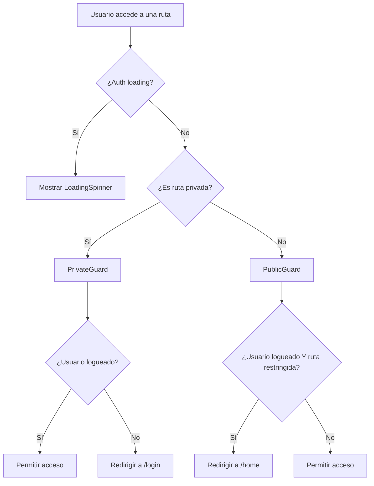

# Sistema de Guards - Prevención de Loops Infinitos

## Descripción General

Este sistema de guards ha sido refactorizado para prevenir loops infinitos de
redirección y proporcionar una experiencia de usuario más robusta.

## Arquitectura del Sistema

### 1. Estructura de Guards

```text
src/guard/
├── PrivateGuard.tsx     # Protege rutas privadas
├── PublicGuard.tsx      # Maneja rutas públicas
├── guard.utils.ts       # Utilidades y helpers
└── README.md           # Esta documentación
```

### 2. Flujo de Redirección



## Casos de Uso Manejados

### 1. PrivateGuard (Rutas Privadas)

| Estado Usuario | Ruta Solicitada | Acción            |
| -------------- | --------------- | ----------------- |
| No logueado    | /home/\*        | Redirige a /login |
| Logueado       | /home/\*        | Permite acceso    |
| Loading        | /home/\*        | Muestra loading   |

### 2. PublicGuard (Rutas Públicas)

| Estado Usuario | Ruta Solicitada | Acción           |
| -------------- | --------------- | ---------------- |
| No logueado    | /login          | Permite acceso   |
| No logueado    | /register       | Permite acceso   |
| Logueado       | /login          | Redirige a /home |
| Logueado       | /register       | Redirige a /home |
| Loading        | Cualquiera      | Muestra loading  |

## Prevención de Loops Infinitos

### 1. Validaciones Implementadas

- **Single Responsibility**: Cada guard tiene una única responsabilidad
- **Estado de Loading**: Evita redirecciones prematuras
- **Validación de Rutas**: Verificación explícita de tipos de ruta
- **Debugging**: Logs detallados para identificar problemas

### 2. Flujo de Datos Controlado

```typescript
// Ejemplo de flujo seguro
if (isLoading) {
  return <LoadingSpinner />;
}

if (!isLoggedIn) {
  return <Navigate to="/login" />;
}

return <Outlet />;
```

### 3. Manejo de Estado de Sesión

- **Persistencia**: El estado se guarda en localStorage
- **Restauración**: Verificación automática al cargar la app
- **Timeout**: Manejo de sesiones expiradas

## Debugging y Logs

### Activar Logs de Debug

Los logs están activos solo en desarrollo:

```typescript
// En guard.utils.ts
export const logGuardAction = (
  guard: "PrivateGuard" | "PublicGuard",
  action: string,
  details: Record<string, unknown>,
): void => {
  if (process.env.NODE_ENV === "development") {
    console.info(`[${guard}] ${action}`, details);
  }
};
```

### Interpretar Logs

```text
[PrivateGuard] Estado verificado {
  isLoggedIn: false,
  isLoading: false,
  pathname: "/home"
}

[PrivateGuard] Redirigiendo a login {
  from: "/home",
  to: "/login"
}
```

## Configuración del Router

### AppRouter Simplificado

```typescript
<Routes>
  <Route element={<PublicGuard />}>
    <Route element={<PublicRoutes />} path="/*" />
  </Route>

  <Route element={<PrivateGuard />}>
    <Route element={<PrivateRoutes />} path="/home/*" />
  </Route>
</Routes>
```

### Ventajas del Enfoque

1. **Separación Clara**: Rutas públicas y privadas completamente separadas
2. **No Overlap**: Evita conflictos de patrones de rutas
3. **Manejo Centralizado**: Lógica de guards en un solo lugar
4. **Debugging Fácil**: Logs detallados para troubleshooting

## Mejores Prácticas

### 1. Orden de Verificación

```typescript
// Siempre en este orden:
1. if (isLoading) return <LoadingSpinner />;
2. if (!isLoggedIn) return <Navigate to="/login" />;
3. return <Outlet />;
```

### 2. Manejo de Estado

```typescript
// Siempre usar replace para evitar historial
<Navigate replace to="/login" />
```

### 3. Preservar Estado de Navegación

```typescript
// Guardar ruta origen para después del login
<Navigate
  to="/login"
  state={{ from: location.pathname }}
  replace
/>
```

## Casos Edge Manejados

1. **Recarga de Página**: Verificación automática de sesión
2. **Sesión Expirada**: Redirección automática a login
3. **Navegación Directa**: Manejo de URLs directas
4. **Estado Intermedio**: Loading states para transiciones suaves
5. **Navegación Programática**: Preservación del estado de navegación

## Testing

### Casos de Prueba Recomendados

1. **Usuario no logueado accede a ruta privada**
2. **Usuario logueado accede a login/register**
3. **Navegación directa a URL privada**
4. **Recarga de página en estado logueado**
5. **Logout y navegación posterior**

### Ejemplo de Test

```typescript
describe('PrivateGuard', () => {
  it('should redirect to login when not authenticated', () => {
    // Mock auth context
    const mockAuthContext = {
      auth: { isLoggedIn: false, isLoading: false },
      authActions: mockAuthActions
    };

    // Render component
    render(
      <AuthContext.Provider value={mockAuthContext}>
        <MemoryRouter initialEntries={['/home']}>
          <Routes>
            <Route element={<PrivateGuard />}>
              <Route path="/home" element={<div>Home</div>} />
            </Route>
          </Routes>
        </MemoryRouter>
      </AuthContext.Provider>
    );

    // Expect redirect
    expect(mockNavigate).toHaveBeenCalledWith('/login');
  });
});
```

## Troubleshooting

### Problemas Comunes

1. **Loop Infinito**: Verificar orden de guards en router
2. **No Redirección**: Verificar estado de loading
3. **Pérdida de Estado**: Verificar persistencia en localStorage
4. **Rutas No Encontradas**: Verificar patrones de rutas

### Soluciones

1. **Habilitar Logs**: Activar logs de debug
2. **Verificar Estado**: Usar React DevTools para auth context
3. **Revisar Network**: Verificar llamadas de API de auth
4. **Limpiar Storage**: Limpiar localStorage si hay datos corruptos
